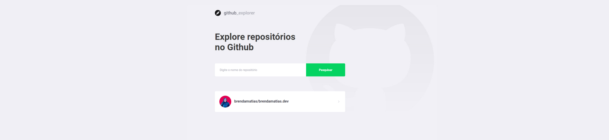

<h1 align="center">
  
</h1>

  
  

  

 

  <a align="center" href="https://gostack-github-explorer.netlify.app/">See the project</a>

## 📑 About

Application developed to perform repositories searches using the Github API.

## :rocket: Technologies

- [React](https://reactjs.org)
- [Netlify](https://www.netlify.com/)

## 💻 Run the project

- Install the dependencies: `yarn install` or `npm install`;
- Run the application: `yarn start` or `npm run start`;
---

